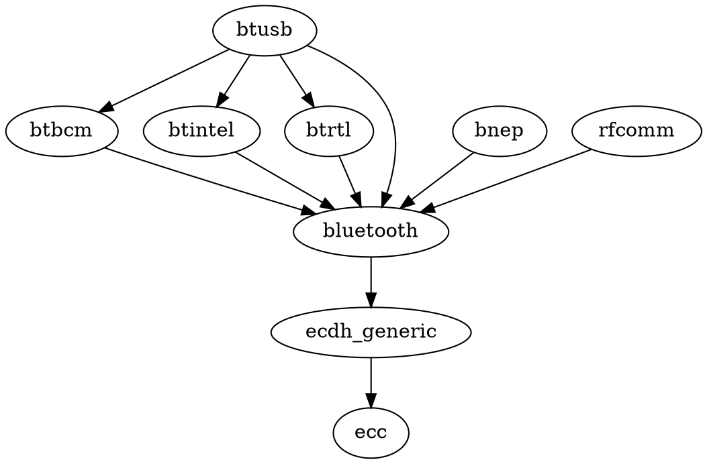

# pylsmod

Draw your Linux kernel module deps using graphviz

[](https://github.com/mrmaximuzz/pylsmod/actions/workflows/python-package.yml)

## Introduction

Linux is a modular kernel, it means that some functionality may be added in the
runtime by loading the corresponding module. The list of active modules is
exported to the userspace in the procfs pseudo-filesystem:

```shell
cat /proc/modules
```

However, the output is designed to be machine-readable, so it is not so easy to
read for humans.

```
. . .
xt_CHECKSUM 16384 1 - Live 0x0000000000000000
xt_MASQUERADE 20480 3 - Live 0x0000000000000000
xt_conntrack 16384 1 - Live 0x0000000000000000
ipt_REJECT 16384 2 - Live 0x0000000000000000
nf_reject_ipv4 16384 1 ipt_REJECT, Live 0x0000000000000000
xt_tcpudp 20480 9 - Live 0x0000000000000000
ip6table_mangle 16384 1 - Live 0x0000000000000000
ip6table_nat 16384 1 - Live 0x0000000000000000
iptable_mangle 16384 1 - Live 0x0000000000000000
iptable_nat 16384 1 - Live 0x0000000000000000
nf_nat 40960 3 xt_MASQUERADE,ip6table_nat,iptable_nat, Live 0x0000000000000000
nf_conntrack 139264 3 xt_MASQUERADE,xt_conntrack,nf_nat, Live 0x0000000000000000
. . .
```

This output contains a lot of information about the loaded module, its binary
size, and which modules depend on other ones. `lsmod` is a well-known frontend
tool, which helps with aligning the `/proc/modules` output it some kind of
table, making it easier to read. Nevertheless, that does not help you when you
need not only to know the list of modules, but to track dependencies between
them, especially between different kernel builds.

`pylsmod` is a simple Python frontend for `/proc/modules` file. It allows you to
create a dependency tree in Graphviz format, making your life a little bit
better.

## Usage

Install the `pylsmod` package. Then prepare a clean directory for the output
files (there may be lots of files, so don't use your working directory for
this):

```shell
mkdir kerneldeps && cd kerneldeps
```

Call the `pylsmod` without the arguments:

```shell
python3 -m pylsmod
```

In this call, `pylsmod` reads your local `/proc/modules` file, creates the
dependency tree, and after that it splits the full tree into independent module
subtrees. These subtrees are written in the current directory, each subtree is
written to the separate `.dot` file. Example of the files generated (Linux Mint,
5.4 kernel):

```
. . .
-rw-rw-r-- 1 user user   37 Jan 1 00:00 acpi_tad.dot
-rw-rw-r-- 1 user user  111 Jan 1 00:00 af_alg.dot
-rw-rw-r-- 1 user user   36 Jan 1 00:00 autofs4.dot
-rw-rw-r-- 1 user user   40 Jan 1 00:00 binfmt_misc.dot
-rw-rw-r-- 1 user user   37 Jan 1 00:00 bpfilter.dot
-rw-rw-r-- 1 user user   33 Jan 1 00:00 cmac.dot
-rw-rw-r-- 1 user user   37 Jan 1 00:00 coretemp.dot
-rw-rw-r-- 1 user user   41 Jan 1 00:00 crc32_pclmul.dot
-rw-rw-r-- 1 user user   45 Jan 1 00:00 crct10dif_pclmul.dot
-rw-rw-r-- 1 user user  205 Jan 1 00:00 cryptd+glue_helper.dot
-rw-rw-r-- 1 user user  138 Jan 1 00:00 dm_log.dot
-rw-rw-r-- 1 user user  321 Jan 1 00:00 ecc.dot
. . .
```

Each file contains a dependency subtree written in a `dot` language, for
example:



If you have `graphviz` software installed, you can convert these `.dot` files to
pictures. A bash oneliner to convert them all:

```bash
for f in *.dot; do dot -Tpng $f > $f.png; done
```

After that, you can open the pictures in your favorite viewer and enjoy the
kernel module dependencies drawn for you automatically. Picture example:


